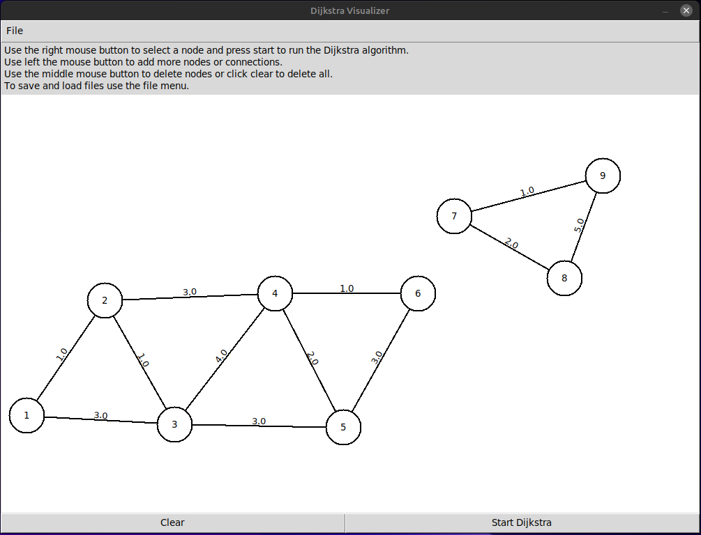

# Dijkstra Visualizer
A simple visualization of th Dijkstra algorithm as tkinter app. 

Allows the creation of custom (undirected) graph and shows the algorithm step-by-step. 

## Dependencies
Requires Python 3.8 or higher and tkinter installed. 
Tkinter is a built-in Python modul, but on some Linux distributions it is not installed on default.
In this case you can install `python3-tk` from the repositories, e.g. on Ubuntu/Debian `sudo apt install python3-tk`.

## Usage
Run `python3 dijkstra_visualizer/main.py` (Windows `pydijkstra_visualizer/main.py`) to start the app. 

The Gui differentiates between two states.
1. The edit mode where you can create and edit your own graph.
2. The Dijkstra visualization mode to show the algorithm step-by-step

### Edit mode
Use **right click** to select a node. 
A selected node servers as start node for a new connection or the algorithm.
To add a new node use **left click**. 
To create a new connection first select the start node (right click) and then click on the end node. 
A new dialog window will pop and ask for the connections weight. 
Use 0 or negative numbers to remove the current connection. 
You can delete nodes using the **middle mouse button** or the 'Clear' button to delete all.
To start the visualization press 'Start Dijkstra'.  

### Dijkstra visualization mode
During the visualization of the Dijkstra algorithm click 'Next Step' to draw the next step 
or use 'Skip to End' to skip all intermediate steps show the result.
With 'Reset' you can return to the edit mode. 
Click with the **left mouse button** a node to show the (currently) calculated shortest path from the start node to this node.

     
Legend:
- \<Number\>: The currently best total distance to start node
- Red outline: Start node
- Dark green background: Currently active node 
- Neon green line: Currently checked neighbour of active node
- Light green background: Already checked nodes